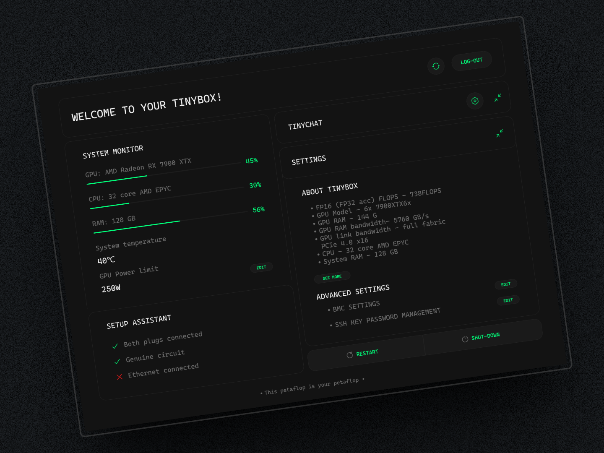
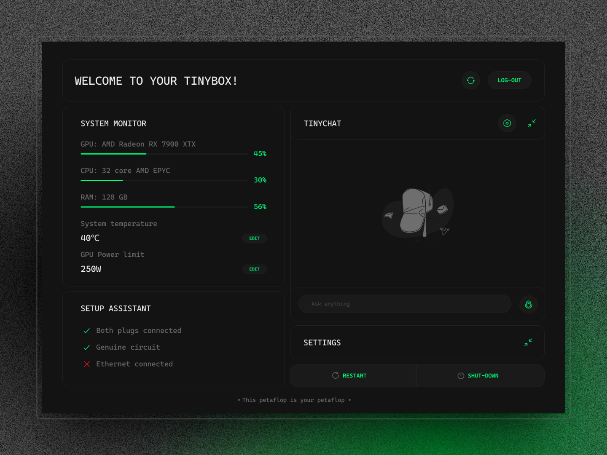

# tinybox-ui

> tinybox said “no ui.”  
> i said “watch me.”

no login. no cloud garbage. no fluff.  
just raw, local power.

setup. chat. power limits. confidence feedback.  
built like code. looks like control.

---

## why i designed it

tinybox is compute as it should be — ruthless, local, hacker-first.  
but even the best machines deserve an interface that *respects the machine*.

not a dashboard. not a frontend.  
more like a shell — visual, fast, silent until needed.

this isn’t a “layer on top.”  
it’s a reflection. a ui that *moves like the hardware*.

---

## features

- **setup flow** – set your power limit and go. no clutter.  
- **confidence feedback** – visualizes the system’s internal “self-trust” in real time.  
- **terminal-style chat** – natural. minimal. feels like code.  
- **live system stats** – temp. usage. performance. at a glance.  
- **local-first respect** – no cloud. no login. no tracking. just you and the metal.  

---

## screenshots

> *(click to expand)*

  

---

## built with

- figma (open source)  
- html mockups (coming soon)

---

## figma file

→ [tinybox-ui (open source)](https://www.figma.com/design/9vL9ux1XHsnogtAViibSVC/tinybox-ui?node-id=0-1&t=nMQSu1j6GfmucY2Y-1)  
duplicate. remix. build. break. rethink it.

---

## more coming

this is v0.0001.  
i’m designing for the kind of local-first future we don’t talk enough about.  
no bloated software. no telemetry. no middlemen.  

just smart design that respects the system.

---

made with obsession by [@ileri](https://x.com/Dahsmartgirl)  
